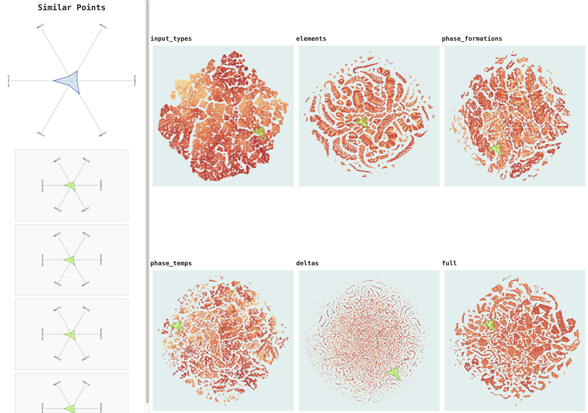
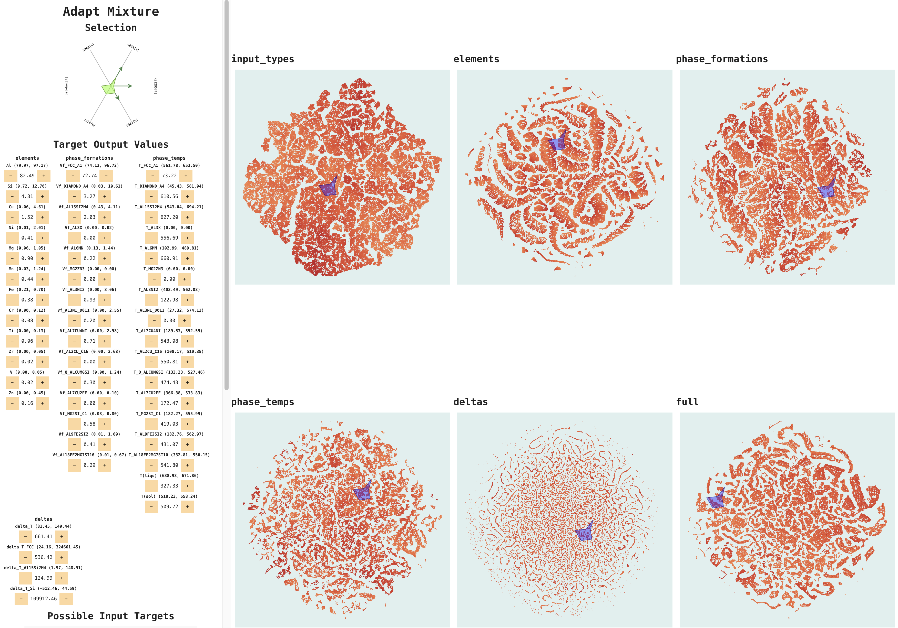
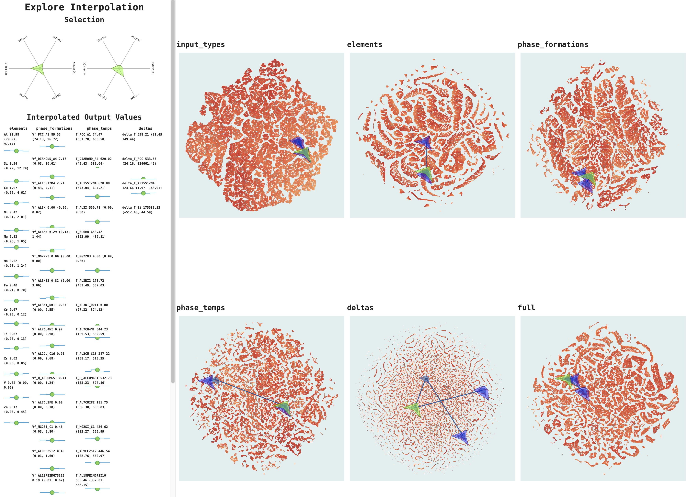

# AlloyInter

## Description

AlloyInter is our entry to the [SciVis Contest 2025](https://sciviscontest2025.github.io/). The approach interpolates between selected input samples over an embedded subspace, guiding the user towards required solutions for their target output parameters.





## Installation
There is a `uv` project already available, but the NVIDIA wheels do not play nice with the correct dependency tree of `uv`. You can install the required dependencies for the backend in a new `venv` using the following commands:
```
pip  install torch torchvision lightgbm  jupyter ipywidgets scikit-learn umap-learn fastapi uvicorn pandas
pip install \
    --extra-index-url=https://pypi.nvidia.com \
    "cudf-cu12==25.6.*" "dask-cudf-cu12==25.6.*" "cuml-cu12==25.6.*" \
    "cugraph-cu12==25.6.*" "nx-cugraph-cu12==25.6.*" "cuxfilter-cu12==25.6.*" \
    "cucim-cu12==25.6.*" "pylibraft-cu12==25.6.*" "raft-dask-cu12==25.6.*" \
    "cuvs-cu12==25.6.*" "nx-cugraph-cu12==25.6.*"
```
Then start the server using
```
python -m uvicorn backend:app --reload 
```
The frontend can be installed and started using
```
npm i -D
npm run dev
```